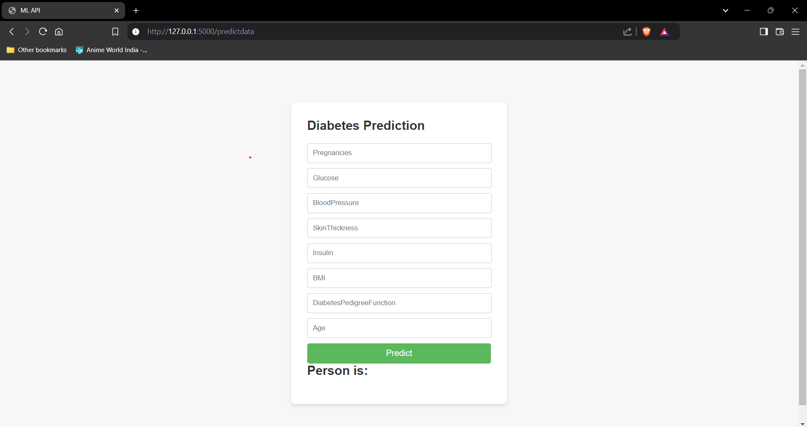

# Diabetes Prediction Web Application

## Overview

This project is a web application that predicts the likelihood of diabetes in an individual using logistic regression. The application is built using Python's Flask framework for the back-end and HTML/CSS for the front-end. The model is trained on the `diabetes.csv` dataset.

## Files in the Repository

- `dataset/`
  - `diabetes.csv`: The dataset used to train the logistic regression model.
- `Notebook/`
  - `Logistic_Regression.ipynb`: Jupyter Notebook containing the code to train and evaluate the logistic regression model.
- `templates/`
  - `index.html ,Home.html ,Single_prediction.html`,: The HTML file for the front-end of the application.
- `model/`
  - `standardScaler.pkl`: The serialized standard scaler used for data preprocessing.
  - `modelForPrediction.pkl`: The serialized logistic regression model.
- `application.py`: The Flask web application that serves the model and handles user inputs.
- `requirements.txt`: A file listing the required Python packages.

## Setup Instructions

### Prerequisites

Ensure you have the following installed:
- Python 3.x
- Pip (Python package installer)

### Install Required Libraries

Run the following command to install the necessary libraries:

```bash
pip install pandas scikit-learn flask
```

### Training the Model

1. Open `Logistic_Regression.ipynb` in Jupyter Notebook.
2. Run the cells to load the dataset, preprocess the data, train the logistic regression model, and save the trained model.

### Running the Web Application

1. Ensure the trained model is saved and accessible by the Flask application.
2. Run the Flask application using the following command:

```bash
python application.py
```

3. Open a web browser and navigate to `http://127.0.0.1:5000/` to access the web application.

## Usage

1. Enter the required input parameters on the web form.
2. Click the "Predict" button to get the prediction results.
3. The application will display whether the individual is likely to have diabetes or not based on the input parameters.

## Front-End

The front-end of the application is built using HTML and CSS. The HTML file contains the structure of the web form, and the CSS file styles the form elements to make the application visually appealing.



## Back-End

The back-end of the application is built using Flask. It handles incoming HTTP requests, processes the input data, uses the trained logistic regression model to make predictions, and returns the results to the user.

## Dataset

The dataset used in this project (`diabetes.csv`) contains the following columns:
- Pregnancies
- Glucose
- BloodPressure
- SkinThickness
- Insulin
- BMI
- DiabetesPedigreeFunction
- Age
- Outcome

## License

This project is licensed under the MIT License. See the LICENSE file for more details.

## Acknowledgments

- [UCI Machine Learning Repository](https://archive.ics.uci.edu/ml/index.php) for the diabetes dataset.
- [Flask](https://flask.palletsprojects.com/en/2.0.x/) framework for providing the back-end infrastructure.
